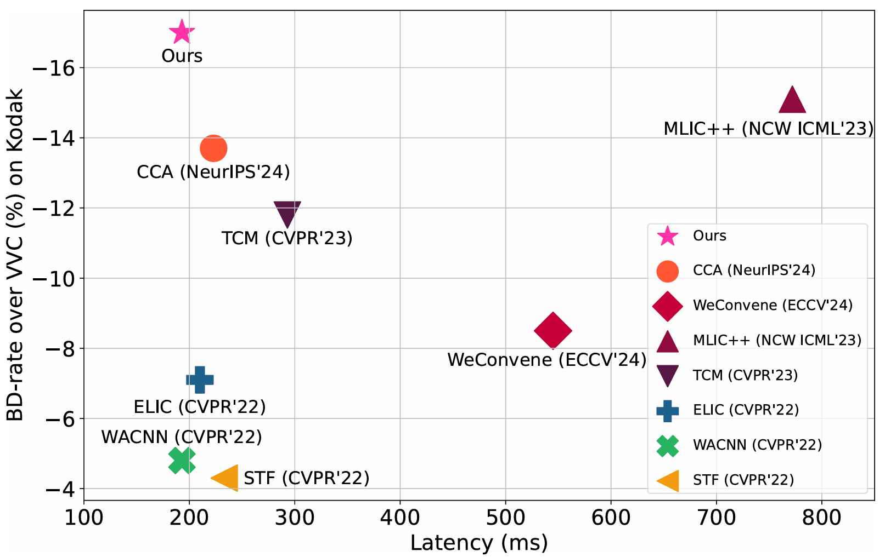
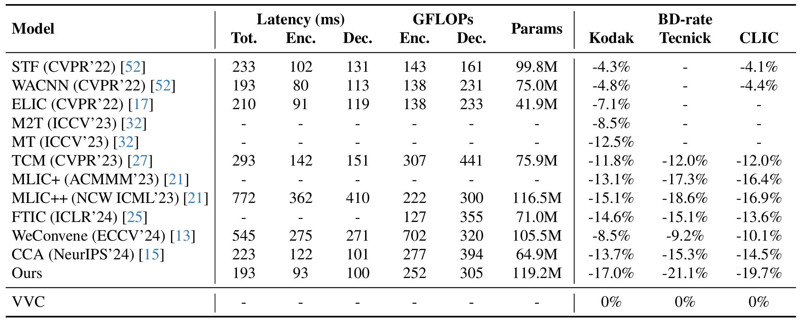

<div align="center">
<h1>DCAE (CVPR 2025)</h1>
<h3>Learned Image Compression with Dictionary-based Entropy Model</h3>

</div>

This is the Pytorch repository of the paper "[Learned Image Compression with Dictionary-based Entropy Model](https://arxiv.org/abs/2504.00496)".

Please feel free to contact Jingbo Lu (jingbolu2023@gmail.com) if you have any questions.

### Abstract
Learned image compression methods have attracted great research interest and exhibited superior rate-distortion performance to the best classical image compression standards of the present. The entropy model plays a key role in learned image compression, which estimates the probability distribution of the latent representation for further entropy coding. Most existing methods employed hyper-prior and auto-regressive architectures to form their entropy models. However, they only aimed to explore the internal dependencies of latent representation while neglecting the importance of extracting prior from training data. In this work, we propose a novel entropy model named Dictionary-based Cross Attention Entropy model, which introduces a learnable dictionary to summarize the typical structures occurring in the training dataset to enhance the entropy model. Extensive experimental results have demonstrated that the proposed model strikes a better balance between performance and latency, achieving state-of-the-art results on various benchmark datasets.

### Performance

***

***


### Installation

Clone this repository:
```bash
git clone https://github.com/LabShuHangGU/DCAE.git
```

Install required packages:
```bash
pip install compressai tensorboard thop timm
```

### Datasets

Download [OpenImages](https://github.com/openimages) for training ; [Kodak](https://r0k.us/graphics/kodak/), [CLIC](https://www.compression.cc/) and [TESTIMAGES](https://testimages.org/) for evaluation.

### Training

A training script for reference is provided in `train.py`.

```bash
CUDA_VISIBLE_DEVICES='0' python -u ./train.py -d [path of training dataset] \
    -lr 1e-4 --cuda --epochs 50 --lr_epoch 46 --batch-size 8 \
    --save_path [path for storing the checkpoints] --save \
    --checkpoint [path of the pretrained checkpoint]
```

The script supports distributed training as well:

```bash
CUDA_VISIBLE_DEVICES='0, 1' python -m torch.distributed.launch --nproc_per_node=[the number of nodes] \
	--master_port=29506 ./train.py -d [path of training dataset] \
    -lr 1e-4 --cuda --epochs 50 --lr_epoch 46 --batch-size 8 \
    --save_path [path for storing the checkpoints] --save \
    --checkpoint [path of the pretrained checkpoint]
```

### Evaluation

```bash
CUDA_VISIBLE_DEVICES='0' python eval.py --checkpoint [path of the pretrained checkpoint] --data [path of test dataset] --cuda
```

### Compress images into bin files

```bash
CUDA_VISIBLE_DEVICE=0 python -u ./compress_and_decompress.py --cuda  --data [path of images to be compressed] \
 --save_path [path for storing the bin files] --mode compress --checkpoint [path of the pretrained checkpoint]
```

### Decompress images from bin files

```bash
CUDA_VISIBLE_DEVICE=0 python -u ./compress_and_decompress.py --cuda  --data [path of bin files to be decompressed] \
 --save_path [path for storing the decompressed images] --mode decompress --checkpoint [path of the pretrained checkpoint]
```
### Pretrained Model
| Lambda | Metric | Link | Lambda | Metric | Link |
|--------|--------|------|--------|--------|------|
| 0.05   | MSE    |   [link](https://drive.google.com/file/d/1jCsRJq7Ttx22-yWQbEQAHJWbdIDtc30k/view)   | 60.5   | MS-SSIM    |   [link](https://drive.google.com/file/d/1S81POfELTNyWmy2mMRlL70vuKjGC5QC_/view)   |
| 0.025  | MSE    |   [link](https://drive.google.com/file/d/1-6ZZ-bScGYj448h1sqMTX4w2Q75MQQ1q/view)   | 31.73  | MS-SSIM    |   [link](https://drive.google.com/file/d/1208tRiJw37ruKON1JVPj2YLp23l2O42U/view)   |
| 0.013  | MSE    |   [link](https://drive.google.com/file/d/1kXfvxsljdN3EfXDGqzknFc2Ecsgf8qgS/view)   | 16.64  | MS-SSIM    |   [link](https://drive.google.com/file/d/1hzgbNPGxfXrwQN-OmTIujGBXCIXYsnW1/view)   |
| 0.0067 | MSE    |   [link](https://drive.google.com/file/d/1LdycatKcGXHvFjoR-NE-GWnPlL9-BRWX/view)   | 8.73   | MS-SSIM    |   [link](https://drive.google.com/file/d/1U-1f24E6IrKjdHvzObnMslYBLA2YAKXe/view)   |
| 0.0035 | MSE    |   [link](https://drive.google.com/file/d/1JE0SO876a-btXzOQLTilj7D0vJdePlB4/view)   | 4.58   | MS-SSIM    |   [link](https://drive.google.com/file/d/1br6rf4WtwLY9NPvRCY3GyVP_lvrXRi9y/view)   |
| 0.0018 | MSE    |   [link](https://drive.google.com/file/d/1JzVuERiZe8cStgLnE5TJii_ssppgY1p-/view)   | 2.40   | MS-SSIM    |   [link](https://drive.google.com/file/d/1BIgupje5UcEwzOch3QG1pooCxRxE6Rtt/view)   |


### Citation

```
@article{lu2025learned,
  title={Learned Image Compression with Dictionary-based Entropy Model},
  author={Lu, Jingbo and Zhang, Leheng and Zhou, Xingyu and Li, Mu and Li, Wen and Gu, Shuhang},
  journal={arXiv preprint arXiv:2504.00496},
  year={2025}
}
```

## Related Repositories

https://github.com/jmliu206/LIC_TCM

https://github.com/InterDigitalInc/CompressAI
